<p align="center">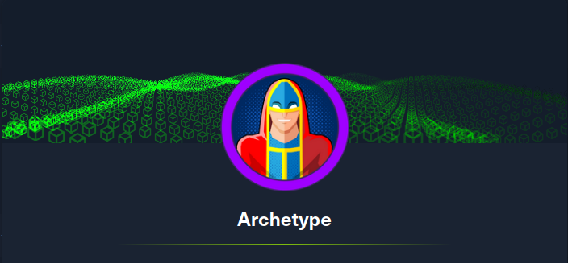</img></p>
<p align="center">Machine creator: Hack The Box</p>
<p align="center">Platform: <a href="https://www.hackthebox.com/">Hack The Box</a></p>

<br>

Archetype is part of the tier's 2 Starting Point machines of Hack The Box.

<br>

- [Reconnaissance](#reconnaissance)
    + [Nmap Scan](#Nmap-scan)
    + [SMB Enumeration](#smb-enumeration)
- [Foothold](#foothold)
    + [Obtaining RCE using Impacket with Microsoft SQL Server](#obtaining-rce-using-impacket-with-microsoft-sql-server)
    + [Obtaining a reverse shell](#obtaining-a-reverse-shell)
- [Privilege Escalation](#privilege-escalation)
    + [System enumeration using WinPEAS](#system-enumeration-using-winpeas)
    + [Escalating privileges](#escalating-privileges)
- [References](#references)

<br>

---

# Reconnaissance

### Nmap Scan

To begin the initial stage we are going to be using Nmap, which is a command line tool that is used to discover hosts and services on a network. It does this by sending packets, which are small units of data, and analysing the responses. Based off the responses it can tell which ports are open and what services are being run on said ports.

`-p-` flag will scan all ports, `--open` flag will report only ports that are opened, `--min-rate 5000` flag will make our scan really fast, useful for closed environments like this, `-n` flag will disable DNS resolutions, `-Pn` flag will disable ARP host discovery, `-vvv` flag will show occurrences while scan is running and `-oG` flag will export the result to said file (useful for grep, see <a href="https://github.com/oscar-rk/scripts/blob/main/Infosec/Recon/extractPorts.sh">extractPorts script</a>).

<p align="center">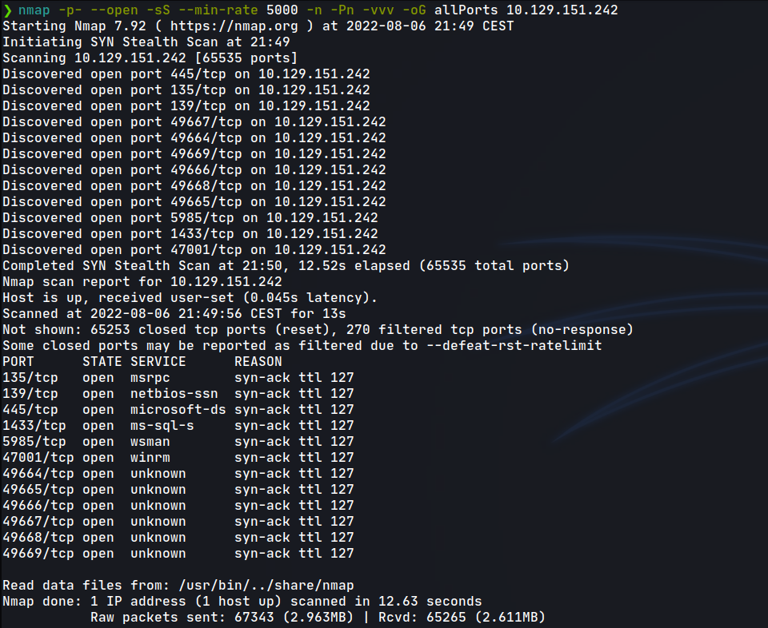</img></p>

Once we know which ports are open, we are going to run a service/version scan with default scripts.

`-sVC` will probe open ports to determine service/version information and run default scripts, `-p` flag will indicate what ports to scan and `-oN` flag will export the result to said file (default nmap format).

<p align="center">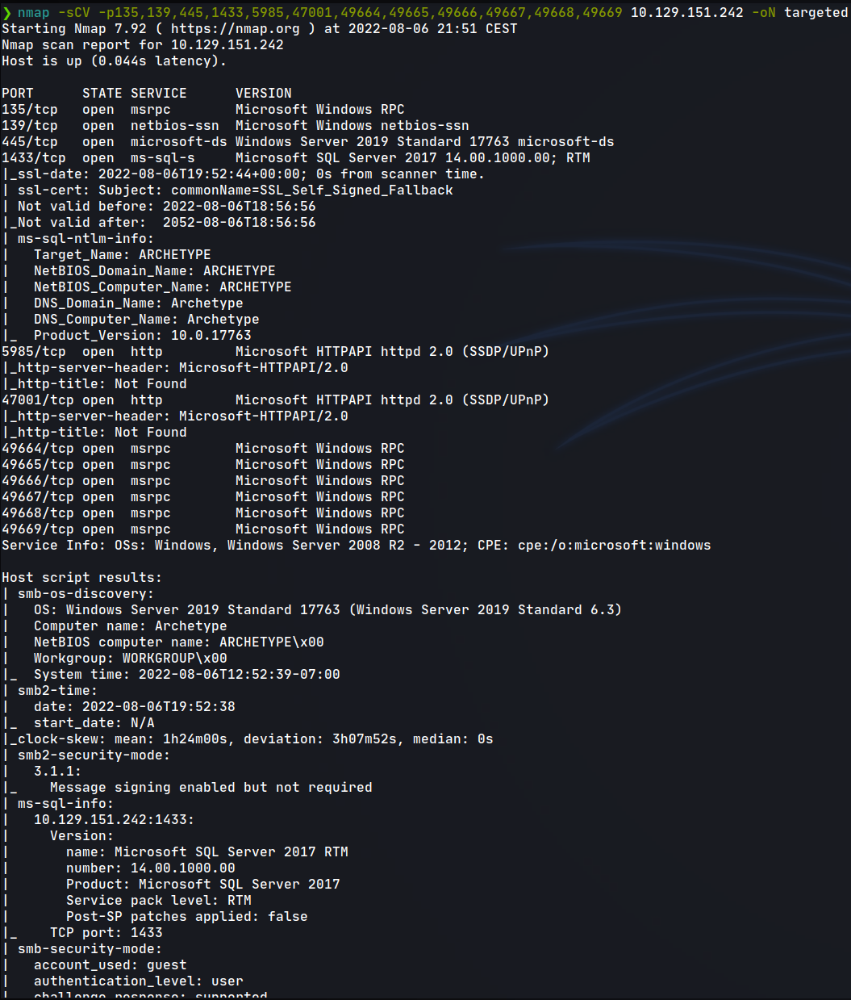</img></p>

### SMB Enumeration

We will start enumerating the SMB port 445 trying to establish a connection in order to list active shares using a null session, since we don't have any users and passwords combination yet.

`-NL` means Null session + Listing.

<p align="center">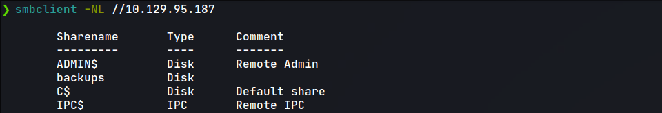</img></p>

We find that there is a `backups` share, so we will attempt to get into it.
Once connected, we will list any files in the share using the command `dir` and `get` if there is any to download it to out machine.

<p align="center">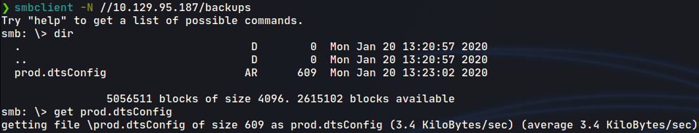</img></p>

Using `cat` we can see the file contents.

<p align="center">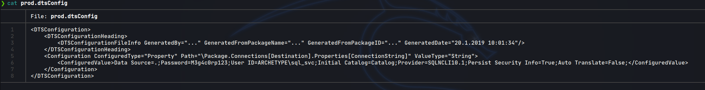</img></p>

We have an username and password combination (__ARCHETYPE\sql_sv::M3g4c0rp123__).

# Foothold

### Obtaining RCE using Impacket with Microsoft SQL Server

As we have found possibly valid credentials, now we move into the foothold stage.

Going back to the Nmap scan, we know that there is a Microsoft SQL server.
It is possible to use an Impacket's script called `mssql.py` in order to establish a connection with the server, allowing us to spawn a shell that we could use to gain access to the system.

The command that we are going to use is `mssqlclient.py -windows-auth ARCHETYPE/sql_svc:M3g4c0rp123@10.129.151.242`

Using the shell, we can enable system's commands execution using the command `enable_xp_cmdshell` and then `reconfigure`, then we will be able to execute any command using `xp_cmdshell <command>`.

```cmd
mssqlclient.py -windows-auth ARCHETYPE/sql_svc:M3g4c0rp123@10.129.151.242
Impacket v0.9.22.dev1+20200611.111621.760cb1ea - Copyright 2020 SecureAuth Corporation

[*] Encryption required, switching to TLS
[*] ENVCHANGE(DATABASE): Old Value: master, New Value: master
[*] ENVCHANGE(LANGUAGE): Old Value: , New Value: us_english
[*] ENVCHANGE(PACKETSIZE): Old Value: 4096, New Value: 16192
[*] INFO(ARCHETYPE): Line 1: Changed database context to 'master'.
[*] INFO(ARCHETYPE): Line 1: Changed language setting to us_english.
[*] ACK: Result: 1 - Microsoft SQL Server (140 3232) 
[!] Press help for extra shell commands
SQL> help

     lcd {path}                 - changes the current local directory to {path}
     exit                       - terminates the server process (and this session)
     enable_xp_cmdshell         - you know what it means
     disable_xp_cmdshell        - you know what it means
     xp_cmdshell {cmd}          - executes cmd using xp_cmdshell
     sp_start_job {cmd}         - executes cmd using the sql server agent (blind)
     ! {cmd}                    - executes a local shell cmd
     
SQL> enable_xp_cmdshell
[*] INFO(ARCHETYPE): Line 185: Configuration option 'show advanced options' changed from 1 to 1. Run the RECONFIGURE statement to install.
[*] INFO(ARCHETYPE): Line 185: Configuration option 'xp_cmdshell' changed from 1 to 1. Run the RECONFIGURE statement to install.
SQL> reconfigure
SQL> xp_cmdshell whoami 
output                                                                             

--------------------------------------------------------------------------------   

archetype\sql_svc                                                                  

NULL    
```

### Obtaining a reverse shell

We now have Remote Code Execution (RCE), so the next stage is to get a reverse shell. A reverse shell is where the target machine, which in this case is the Windows machine initiates the connection to our machine, which is listening for incoming connections on a specific port.

We will be using the binary of `netcat` `nc.exe`, it should be available in your Kali or Parrot machine. The process will be:

1. Listen for incoming connections using the `netcat` Linux command `nc -lvp <port>`.
2. Serve the binary of `netcat` using a HTTP Server deployed with a `Python` one-liner.
3. From the target machine, download the `netcat` binary that we are serving and store it in the `Users/Public` folder.
4. From the Microsoft SQL shell, execute a command calling the downloaded `netcat` binary in order to send a reverse shell to our machine, using the port specified at point 1.

So let's go ahead:

1. Listen for incoming connections using the `netcat` Linux command `nc -lvp <port>`.

<p align="center">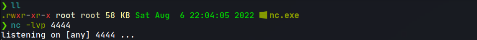</img></p>

2. Serve the binary of `netcat` using a HTTP Server deployed with a `Python` one-liner.

<p align="center">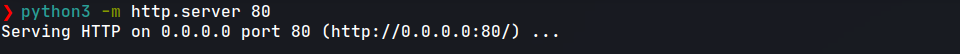</img></p>

3. From the target machine, download the `netcat` binary that we are serving and store it in the `Users/Public` folder.

<p align="center">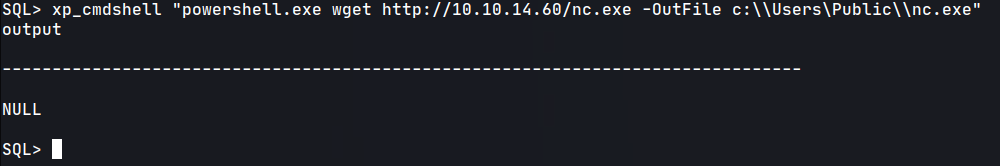</img></p>

4. From the Microsoft SQL shell, execute a command calling the downloaded `netcat` binary in order to send a reverse shell to our machine, using the port specified at point 2.

<p align="center">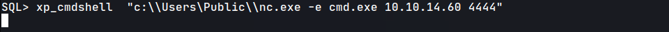</img></p>

As we can see, now we have Remote Command Execution.

<p align="center">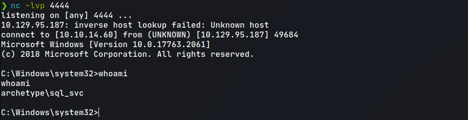</img></p>

We can `type` the user flag located in `C:\Users\sql_svc\Desktop`.

# Privilege Escalation

### System enumeration using WinPEAS

We have now obtained the user flag, so the next step is Privilege escalation. Which is the act of exploiting a bug or a misconfiguration of an application to elevate our account from a normal user to an administrator or root user. 

We can use a tool called `WinPEASx64.exe` in order to enumerate the system in search of flaws.

The process will be similar this time, we will serve the binary of `WinPEASx64.exe` using the `Python` one-liner and download it from the target machine.

<p align="center">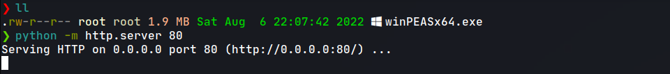</img></p>

<p align="center">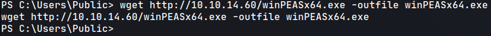</img></p>

In order to enumerate system information with `WinPEAS` we will use the command `./winpeas.exe systeminfo`.

We will find something that calls our attention.
It seems that there is a `PowerShell` history file that we can read.

<p align="center">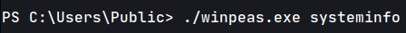</img></p>
<p align="center">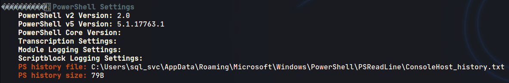</img></p>

If we use the command `type` in order to read the file contents we find that the `net` command used by the administrator to create the SMB share `backups` is there. So now we have the administrator credentials (__administrator::MEGACORP_4dm1n!!__).

<p align="center">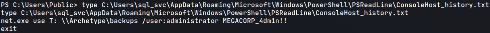</img></p>

### Escalating privileges

Going back to Impacket, there is another script called `psexec.py` which is a tool that allows you to connect using users credentials. We could also use `evil-winrm`.

The command is: `psexec.py <user>:<password>@IP`.

In our case, we had to escape the `!` symbols in the password in order to make it work.

<p align="center">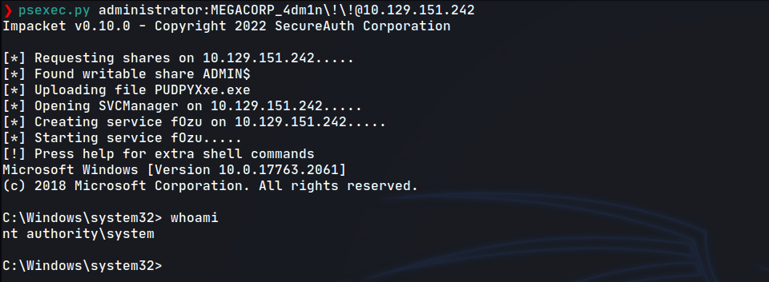</img></p>

We can `type` the administrator flag located in `C:\Users\Administrator\Desktop`.

---

# References

|__`Impacket`__|__https://github.com/SecureAuthCorp/impacket__|
|:-|:-|
|__Pentesting MS SQL__|__https://book.hacktricks.xyz/network-services-pentesting/pentesting-mssql-microsoft-sql-server__|
|__`WinPEAS`__|__https://github.com/carlospolop/PEASS-ng/tree/master/winPEAS__|


<br>
<br>

___─ Written by <a href="https://github.com/oscar-rk">oscar-rk</a> ─___